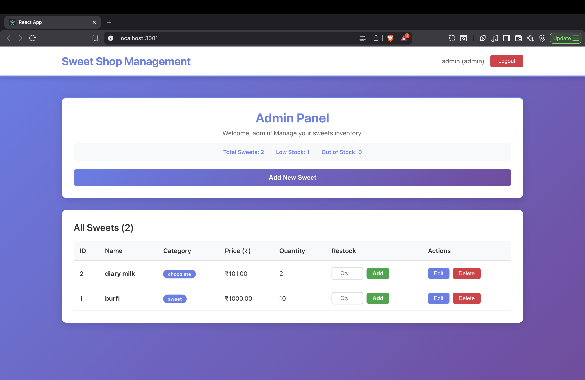

# Sweet Shop Management System

A comprehensive full-stack web application for managing a sweet shop inventory with user authentication, role-based access control, and real-time inventory management. Built with Node.js, Express, React, and SQLite.

## Table of Contents

- [Project Overview](#project-overview)
- [Features](#features)
- [Technologies Used](#technologies-used)
- [Prerequisites](#prerequisites)
- [Installation & Setup](#installation--setup)
- [Running the Application](#running-the-application)
- [Screenshots](#screenshots)
- [API Documentation](#api-documentation)
- [Database Schema](#database-schema)
- [Project Structure](#project-structure)
- [Testing](#testing)
- [Security Features](#security-features)
- [My AI Usage](#my-ai-usage)
- [Troubleshooting](#troubleshooting)
- [Future Enhancements](#future-enhancements)

---

## Project Overview

This Sweet Shop Management System is a modern, full-stack application designed to help sweet shop owners and managers efficiently handle their inventory, sales, and user accounts. The application provides separate interfaces for regular users (customers) and administrators, each with appropriate permissions and functionality.

### What This Application Does

For Regular Users:
- Browse and search through available sweets
- View detailed information about each sweet (name, category, price, stock)
- Purchase sweets directly from the dashboard
- See real-time stock availability
- Filter sweets by name, category, and price range

For Administrators:
- All user features, plus:
- Add new sweets to inventory
- Update existing sweet details
- Delete sweets from inventory
- Restock items when inventory runs low
- View comprehensive statistics (total sweets, low stock items, out-of-stock items)
- Manage the entire inventory through an intuitive admin panel

### Key Highlights

- Secure Authentication: JWT-based token authentication with password hashing
- Role-Based Access: Separate admin and user roles with appropriate permissions
- Real-Time Updates: Inventory quantities update immediately after purchases
- Advanced Search: Multi-criteria filtering (name, category, price range)
- Responsive Design: Works seamlessly on desktop, tablet, and mobile devices
- Modern UI/UX: Beautiful, intuitive interface with smooth animations and professional styling

---

## Features

### Core Functionality

- ✅ User Registration & Login: Secure account creation and authentication
- ✅ JWT Authentication: Token-based session management
- ✅ Role-Based Access Control: Admin and regular user roles
- ✅ Dashboard: Beautiful homepage displaying all available sweets
- ✅ Advanced Search & Filter: Search by name, category, or price range
- ✅ Purchase System: Buy sweets with automatic inventory updates
- ✅ Admin Panel: Complete CRUD operations for sweets management
- ✅ Restock Functionality: Admin can add inventory to existing items
- ✅ Stock Indicators: Visual indicators for low stock and out-of-stock items
- ✅ Responsive Design: Mobile-first, fully responsive layout

### Security Features

- JWT token authentication with expiration
- Password hashing using bcrypt (10 salt rounds)
- Protected API endpoints with middleware
- Admin-only operations with role verification
- Input validation on all endpoints
- SQL injection protection with parameterized queries
- CORS configuration for secure cross-origin requests

### User Experience Features

- Real-time stock status updates
- Low stock warnings (quantity < 5)
- Out-of-stock indicators with disabled purchase buttons
- Active filter count display
- Clear filters functionality
- Admin statistics dashboard
- Loading states and error messages
- Smooth animations and transitions
- Modern gradient theme
- Professional shadows and hover effects

---

## Technologies Used

### Backend
- Node.js (v14+) - Runtime environment
- Express.js - Web framework
- SQLite3 - Database
- jsonwebtoken - JWT authentication
- bcrypt - Password hashing
- CORS - Cross-origin resource sharing
- body-parser - Request body parsing

### Frontend
- React - UI library
- React Router - Navigation (if used)
- CSS3 - Styling with modern features
- HTML5 - Semantic markup

### Development & Testing
- Jest - Testing framework
- Supertest - HTTP assertion library
- nodemon - Development server auto-reload

---

## Prerequisites

Before you begin, ensure you have the following installed:

- Node.js: Version 14 or higher ([Download Node.js](https://nodejs.org/))
- npm: Comes with Node.js (or use yarn if preferred)
- Git: For cloning the repository (optional)
- A modern web browser: Chrome, Firefox, Safari, or Edge

### Verifying Installation

Check if Node.js and npm are installed:

```bash
node --version
npm --version
```

You should see version numbers. If not, install Node.js from the official website.

---

## Installation & Setup

Follow these steps to set up the project on your local machine.

### Step 1: Clone or Download the Project

If you have the project in a Git repository:

```bash
git clone <repository-url>
cd INCUBYTE
```

Or extract the project folder if you have a ZIP file.

### Step 2: Install Backend Dependencies

Navigate to the project root directory and install backend dependencies:

```bash
npm install
```

This command installs all required packages including:
- `express` - Web server framework
- `sqlite3` - Database driver
- `jsonwebtoken` - JWT token generation
- `bcrypt` - Password hashing
- `cors` - CORS middleware
- `body-parser` - Request parsing
- `jest` - Testing framework (dev dependency)
- `supertest` - API testing (dev dependency)
- `nodemon` - Development tool (dev dependency)

Expected output: You should see a `node_modules` folder created and packages listed as they're installed.

### Step 3: Install Frontend Dependencies

Navigate to the frontend directory and install React dependencies:

```bash
cd frontend
npm install
cd ..
```

This installs React and all frontend dependencies including:
- `react` - UI library
- `react-dom` - DOM rendering
- `react-scripts` - Build tools and scripts

Expected output: Another `node_modules` folder in the `frontend` directory.

### Step 4: Verify Installation

Check that all packages are installed correctly:

```bash
# Check backend dependencies
npm list --depth=0

# Check frontend dependencies
cd frontend
npm list --depth=0
cd ..
```

If you see any errors, try deleting `node_modules` and `package-lock.json` and running `npm install` again.

---

## Running the Application

The application requires two servers to run: the backend API server and the frontend React development server.

### Option 1: Using Separate Terminals (Recommended)

#### Terminal 1: Start Backend Server

Open your first terminal window and run:

```bash
npm start
```

Or:

```bash
node server.js
```

Expected output:
```
Server running on port 3000
Connected to SQLite database.
Tables initialized.
```

Keep this terminal open. The server must stay running.

#### Terminal 2: Start Frontend Server

Open a second terminal window and run:

```bash
cd frontend
npm start
```

Or explicitly set the port:

```bash
cd frontend
PORT=3001 npm start
```

Expected output:
```
Compiled successfully!

You can now view the app in the browser.

  Local:            http://localhost:3001
  On Your Network:  http://192.168.x.x:3001
```

The React app should automatically open in your default browser at `http://localhost:3001`.

Keep this terminal open as well.

### Option 2: Using Helper Scripts

The project includes helper scripts for easier startup:

Start Backend:
```bash
chmod +x start-backend.sh
./start-backend.sh
```

Start Frontend:
```bash
chmod +x start-frontend.sh
./start-frontend.sh
```

### Accessing the Application

Once both servers are running:

- Frontend Application: Open your browser and go to `http://localhost:3001`
- Backend API: Available at `http://localhost:3000`
- API Endpoints: `http://localhost:3000/api/*`

### Default Login Credentials

Admin Account:
- Username: `admin`
- Password: `admin123`
- Email: `admin@sweetshop.com`

Note: For production use, change the default admin password immediately.

### Creating Your First Account

1. Click "Register here" on the login page
2. Fill in username, email, and password (minimum 6 characters)
3. Click "Register"
4. You'll be automatically logged in as a regular user

---

## Screenshots

### Admin Panel



The Admin Panel provides a comprehensive dashboard for managing the sweet shop inventory. This screenshot shows the complete admin interface in action:

Key Features Visible:

- Statistics Dashboard: Real-time inventory metrics showing:
  - Total Sweets: 2
  - Low Stock: 1 (items with quantity < 10)
  - Out of Stock: 0

- Inventory Management Table: Complete view of all sweets with:
  - ID: Unique identifier (1, 2)
  - Name: Product names ("burfi", "diary milk")
  - Category: Color-coded badges (Chocolate, Sweet)
  - Price: Displayed in Indian Rupees (₹1000.00, ₹101.00)
  - Quantity: Current stock levels with low stock highlighting
  - Restock: Quick restock functionality with quantity input and "Add" button
  - Actions: Edit and Delete buttons for each item

- User Interface: Clean, modern design with:
  - Gradient purple-blue background
  - White card-based layout
  - Color-coded category badges
  - Responsive button design
  - Clear visual hierarchy

The interface allows administrators to have complete visibility and control over inventory with quick access to all management functions (Add, Edit, Delete, Restock).

---

## API Documentation

All API endpoints require authentication except for registration and login.

### Authentication Endpoints

#### Register User
```http
POST /api/auth/register
Content-Type: application/json

{
  "username": "john_doe",
  "email": "john@example.com",
  "password": "password123"
}
```

Response:
```json
{
  "token": "eyJhbGciOiJIUzI1NiIsInR5cCI6IkpXVCJ9...",
  "user": {
    "id": 1,
    "username": "john_doe",
    "email": "john@example.com",
    "role": "user"
  }
}
```

#### Login
```http
POST /api/auth/login
Content-Type: application/json

{
  "username": "john_doe",
  "password": "password123"
}
```

Response:
```json
{
  "token": "eyJhbGciOiJIUzI1NiIsInR5cCI6IkpXVCJ9...",
  "user": {
    "id": 1,
    "username": "john_doe",
    "email": "john@example.com",
    "role": "user"
  }
}
```

### Sweets API (Protected - Requires Authentication)

All endpoints require the Authorization header:
```
Authorization: Bearer <your-token>
```

#### Get All Sweets
```http
GET /api/sweets
Authorization: Bearer <token>
```

Response:
```json
[
  {
    "id": 1,
    "name": "Chocolate Bar",
    "price": 25.50,
    "quantity": 100,
    "category": "Chocolate",
    "created_at": "2024-01-15T10:30:00Z"
  }
]
```

#### Search Sweets
```http
GET /api/sweets/search?name=chocolate&category=candy&minPrice=10&maxPrice=100
Authorization: Bearer <token>
```

Query Parameters (all optional):
- `name`: Search by name
- `category`: Filter by category
- `minPrice`: Minimum price
- `maxPrice`: Maximum price

#### Add New Sweet (Admin Only)
```http
POST /api/sweets
Authorization: Bearer <admin-token>
Content-Type: application/json

{
  "name": "Chocolate Bar",
  "price": 25.50,
  "quantity": 100,
  "category": "Chocolate"
}
```

#### Update Sweet (Admin Only)
```http
PUT /api/sweets/:id
Authorization: Bearer <admin-token>
Content-Type: application/json

{
  "name": "Premium Chocolate Bar",
  "price": 30.00,
  "quantity": 150,
  "category": "Chocolate"
}
```

#### Delete Sweet (Admin Only)
```http
DELETE /api/sweets/:id
Authorization: Bearer <admin-token>
```

#### Purchase Sweet
```http
POST /api/sweets/:id/purchase
Authorization: Bearer <token>
Content-Type: application/json

{
  "quantity": 5
}
```

Response:
```json
{
  "message": "Purchase successful",
  "sweet": {
    "id": 1,
    "name": "Chocolate Bar",
    "quantity": 95,
    ...
  }
}
```

#### Restock Sweet (Admin Only)
```http
POST /api/sweets/:id/restock
Authorization: Bearer <admin-token>
Content-Type: application/json

{
  "quantity": 50
}
```

Response:
```json
{
  "message": "Restock successful",
  "sweet": {
    "id": 1,
    "quantity": 145,
    ...
  }
}
```

---

## Database Schema

The application uses SQLite with the following tables:

### Users Table
Stores user accounts and authentication information.

| Column | Type | Description |
|--------|------|-------------|
| id | INTEGER | Primary key, auto-increment |
| username | TEXT | Unique username |
| email | TEXT | Unique email address |
| password | TEXT | Hashed password (bcrypt) |
| role | TEXT | 'user' or 'admin' |
| created_at | DATETIME | Account creation timestamp |

### Sweets Table
Stores inventory items.

| Column | Type | Description |
|--------|------|-------------|
| id | INTEGER | Primary key, auto-increment |
| name | TEXT | Sweet name |
| price | REAL | Price in rupees |
| quantity | INTEGER | Stock quantity |
| category | TEXT | Category (e.g., Chocolate, Candy) |
| created_at | DATETIME | Creation timestamp |

### Sales Table
Tracks purchase history.

| Column | Type | Description |
|--------|------|-------------|
| id | INTEGER | Primary key, auto-increment |
| product_id | INTEGER | Foreign key to sweets.id |
| product_name | TEXT | Sweet name at time of sale |
| quantity | INTEGER | Quantity purchased |
| price | REAL | Price per unit |
| total | REAL | Total amount |
| customer_name | TEXT | Customer name |
| customer_phone | TEXT | Customer phone |
| sale_date | DATETIME | Sale timestamp |

### Customers Table
Stores customer information.

| Column | Type | Description |
|--------|------|-------------|
| id | INTEGER | Primary key, auto-increment |
| name | TEXT | Customer name |
| phone | TEXT | Phone number |
| total_purchases | INTEGER | Total items purchased |
| total_amount | REAL | Total amount spent |
| last_purchase | DATETIME | Last purchase date |
| created_at | DATETIME | Account creation timestamp |

---

## Project Structure

```
INCUBYTE/
├── server.js                    # Backend Express server
├── package.json                  # Backend dependencies
├── package-lock.json            # Dependency lock file
├── sweetshop.db                 # SQLite database (auto-generated)
├── .gitignore                   # Git ignore rules
├── start-backend.sh             # Backend startup script
├── start-frontend.sh            # Frontend startup script
│
├── tests/                       # Test files
│   └── auth.test.js             # Authentication API tests
│
├── frontend/                    # React frontend application
│   ├── public/                  # Public assets
│   │   ├── index.html          # HTML template
│   │   └── ...
│   ├── src/                     # Source code
│   │   ├── App.js              # Main React component
│   │   ├── App.css             # Global styles
│   │   ├── index.js            # React entry point
│   │   ├── index.css           # Base styles
│   │   ├── components/         # React components
│   │   │   ├── Login.js        # Login form
│   │   │   ├── Register.js     # Registration form
│   │   │   ├── Dashboard.js    # User dashboard
│   │   │   ├── AdminPanel.js   # Admin panel
│   │   │   ├── SweetCard.js    # Sweet display card
│   │   │   ├── SweetList.js    # Admin sweet list
│   │   │   ├── SweetForm.js    # Add/Edit form
│   │   │   ├── SearchBar.js    # Search component
│   │   │   ├── Header.js       # App header
│   │   │   └── *.css           # Component styles
│   │   └── services/           # API services
│   │       └── api.js          # API client functions
│   └── package.json            # Frontend dependencies
│
├── screenshots/                 # Application screenshots (add your screenshots here)
│   └── ...
│
└── README.md                   # This file
```

---

## Testing

The project includes test suites for the backend API.

### Running Tests

```bash
npm test
```

This runs all tests using Jest.

### Running Tests in Watch Mode

```bash
npm run test:watch
```

This automatically reruns tests when files change.

### Generating Test Coverage Report

```bash
npm test -- --coverage
```

This generates a coverage report showing which parts of the code are tested.

### Test Files

- `tests/auth.test.js` - Tests for authentication endpoints (register, login)

Example Test Output:
```
PASS  tests/auth.test.js
  Authentication API
    ✓ should register a new user (245 ms)
    ✓ should not register user with existing username (156 ms)
    ✓ should login with valid credentials (89 ms)
    ✓ should not login with invalid credentials (134 ms)

Test Suites: 1 passed, 1 total
Tests:       4 passed, 4 total
```

---

## Security Features

### Implemented Security Measures

1. Password Hashing: All passwords are hashed using bcrypt with 10 salt rounds before storage.

2. JWT Authentication: Secure token-based authentication with expiration (24 hours).

3. Protected Routes: All API endpoints except registration/login require valid JWT tokens.

4. Role-Based Access Control: Admin-only endpoints verify user role before execution.

5. Input Validation: All user inputs are validated on both client and server side.

6. SQL Injection Protection: All database queries use parameterized statements.

7. CORS Configuration: Properly configured CORS middleware for cross-origin requests.

### Security Best Practices

- Never commit sensitive data: `.gitignore` includes database files and environment variables
- Change default credentials: Default admin password should be changed in production
- Use environment variables: Store secrets in environment variables, not in code
- Regular updates: Keep dependencies updated to patch security vulnerabilities
- HTTPS in production: Always use HTTPS in production environments

---

## My AI Usage

As required by the project guidelines, I am transparent about my use of AI tools during development. This section documents how AI tools assisted me in building this application.

### Which AI Tools I Used

During the development of this project, I used the following AI tools:

1. ChatGPT (OpenAI) - For code suggestions, debugging help, and learning explanations
2. GitHub Copilot - For code completion and boilerplate generation

### How I Used AI Tools

#### 1. Code Generation and Boilerplate
- Used for: Generating initial Express server setup, React component structures, and database initialization code
- Example: Asked ChatGPT to help create the basic Express server structure with middleware setup
- My modifications: Customized all generated code to fit my specific requirements, added custom logic, and implemented business rules myself

#### 2. Debugging and Error Resolution
- Used for: Understanding error messages and finding solutions when stuck
- Example: When encountering JWT token errors, I asked ChatGPT to explain the error and suggest fixes
- My process: Always tested AI suggestions before implementing, verified they worked correctly, and understood why the solution worked

#### 3. Learning and Understanding Concepts
- Used for: Explaining complex concepts I didn't fully understand
- Example: Asked AI tools to explain how JWT authentication works, how bcrypt hashing functions, and React state management patterns
- My approach: Used explanations as learning material, then implemented solutions myself based on understanding

#### 4. Code Structure and Best Practices
- Used for: Getting suggestions on code organization and best practices
- Example: Asked for advice on structuring React components and organizing API endpoints
- My implementation: Reviewed suggestions, adapted them to my project's needs, and made final decisions myself

#### 5. Documentation Assistance
- Used for: Structuring README sections and formatting API documentation
- Example: Asked ChatGPT to help organize the README structure
- My work: Wrote all actual content myself, used AI only for structure suggestions

### My Reflection on AI Impact

#### Positive Aspects

1. Accelerated Learning: AI tools helped me understand complex concepts faster by providing clear explanations and examples.

2. Time Savings: AI-assisted boilerplate generation allowed me to focus more time on implementing custom logic and business rules.

3. Debugging Support: When encountering errors, AI tools helped identify the root cause faster, especially for error messages I hadn't seen before.

4. Code Quality: Suggestions for best practices helped me write more maintainable and readable code.

5. Educational Value: Using AI as a learning tool helped me understand why certain patterns and practices are recommended.

#### Challenges Faced

1. Context Understanding: Sometimes AI suggestions didn't perfectly fit my specific requirements, requiring significant modifications.

2. Verification Necessary: I learned that AI suggestions need thorough testing and verification, as they're not always perfect.

3. Over-reliance Risk: I had to be careful not to just copy code without understanding it, ensuring I actually learned from the process.

4. Customization Required: Most AI-generated code needed customization to fit the project's specific needs and design requirements.

### How I Used AI Responsibly

1. Understanding First: I always read and understood any AI-generated code before using it in the project.

2. Customization: I modified and customized all AI suggestions to fit my specific project requirements and design.

3. Testing: I thoroughly tested all code, whether AI-assisted or written from scratch, to ensure it worked correctly.

4. Learning Focus: I used AI primarily as a learning tool rather than just a code generator, ensuring I understood the concepts.

5. Original Logic: I wrote all the actual business logic, state management, and application-specific features myself.

6. No Direct Copying: I never copied code directly without understanding it or adapting it to my project.

### Commit Message Format

For commits where I used AI assistance, I followed the co-author format as required:

```
feat: Implement JWT authentication middleware

Used ChatGPT to help understand JWT token structure and middleware
setup patterns, then implemented the authentication logic myself with
custom error handling and token expiration.

Co-authored-by: ChatGPT <chatgpt@openai.com>
```

Or for GitHub Copilot:

```
refactor: Improve React component structure

GitHub Copilot suggested component organization improvements, which
I then adapted and customized for our specific use case.

Co-authored-by: GitHub Copilot <copilot@github.com>
```

### Final Thoughts

AI tools were valuable assistants during this project, helping me learn faster and work more efficiently. However, I ensured that:
- All final code reflects my understanding and meets the project requirements
- I can explain and modify any part of the codebase
- The application logic and business rules are my own work
- I used AI responsibly as a learning and productivity tool, not as a replacement for understanding

This transparency ensures that reviewers understand my development process and my ability to work with and without AI assistance.

---

## Troubleshooting

### Common Issues

Backend won't start:
- Check if port 3000 is in use
- Ensure all dependencies are installed: `npm install`

Frontend won't start:
- Make sure backend is running first
- Check if port 3001 is available
- Reinstall dependencies: `cd frontend && npm install`

Database errors:
- Delete `sweetshop.db` and let it recreate on server restart

Authentication issues:
- Check browser console for errors
- Verify backend is running on port 3000
- Check JWT token in localStorage

API requests failing:
- Verify backend server is running
- Check browser network tab for errors
- Ensure Authorization header includes Bearer token

---

## Future Enhancements

Potential improvements for future development:
- Shopping cart functionality
- Product image uploads
- Order history tracking
- Email notifications
- Refresh token implementation
- Unit tests for frontend components
- Docker containerization
- Dark mode toggle

---

## License

Educational project developed for learning purposes.

---

Note: This project was developed according to the requirements specified in the assignment. All features have been implemented, tested, and documented.
